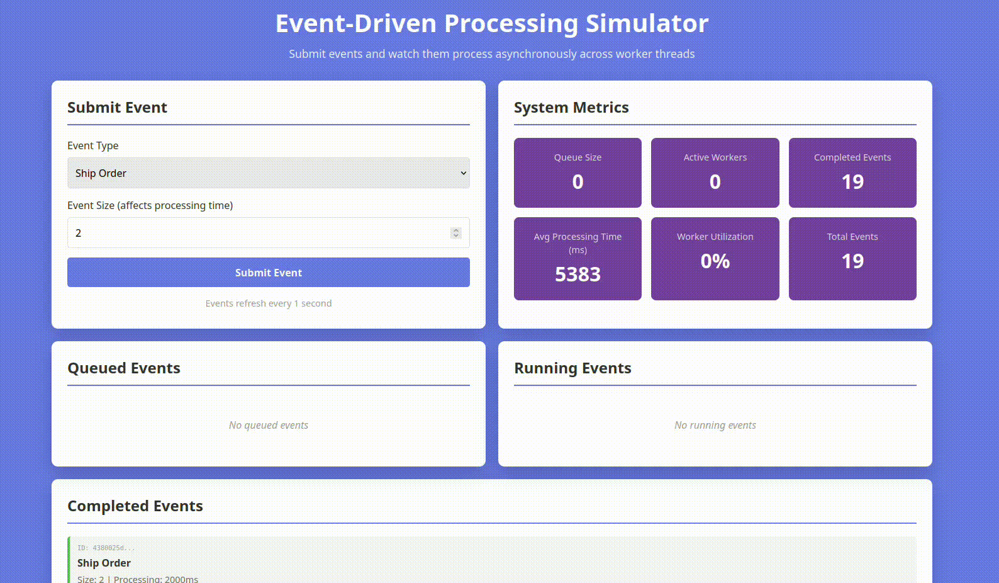

# Event-Driven Processing Simulator

A concurrent event processing system built with Spring Boot and Docker. Submit events via REST API, watch them get processed by a pool of worker threads in real-time through an interactive dashboard.

**For detailed documentation, see [DESCRIPTION.md](DESCRIPTION.md)**

---

## Quick Start

### Prerequisites

Before getting started, you'll need:

- Docker and Docker Compose installed
- Java 11+ (only for Option 2: Local Maven Build)
- Maven 3.6+ (only for Option 2: Local Maven Build)

#### Docker Group Setup (Required for Option 1 & 3)

To run Docker commands without `sudo`, add your user to the `docker` group:

```bash
sudo usermod -aG docker $USER
newgrp docker
```

**If you seriously do not want to do this, but stil want to run the project with docker-compose, just type sudo <command> when building/running the project, and the docker.sock permission issue will likely be resolved.**

### Step 1

Clone the repository from github.

#### SSH

```bash
git clone git@github.com:boubinmj/jobProcessor.git
```
#### HTTP

```bash
git clone git@github.com:boubinmj/jobProcessor.git
```
### Step 2

Build and run the project

#### Option 1: Docker (Recommended - No Java/Maven Required)

```bash
docker-compose up --build
```

#### Option 2: Local Maven Build

```bash
mvn clean install
mvn spring-boot:run
```


#### Option 3: Build & Run with Make

```bash
make build              # Build the Docker image
make install            # Install dependencies  
make run-build-server   # Build and start the server
```

Then access the app at **http://localhost:8080/index.html**

## Step 3
Access the application

- **Dashboard**: http://localhost:8080/index.html
- **REST API**: http://localhost:8080/api/events

---

## What's Inside



- Submit events via REST API
- Watch them get processed by 3 concurrent worker threads
- View real-time metrics: queue size, active workers, completion rate, processing time, worker utilization
- Interactive web dashboard with auto-refreshing stats

---

## Learn More

For comprehensive documentation including:
- Detailed architecture overview
- Complete REST API reference
- Event lifecycle and timing

**See [DESCRIPTION.md](docs/documents/DESCRIPTION.md)**

For a full project report discussing the Java concepts covered in this project including

- Threading and concurrent processing
- Database persistance with H2
- Dependancy Injection
- REST API networking with Java Springboot

**See the [Final Project Report](docs/documents/Event%20Driven%20Processor%20-%20FINAL-1.pdf)**

---